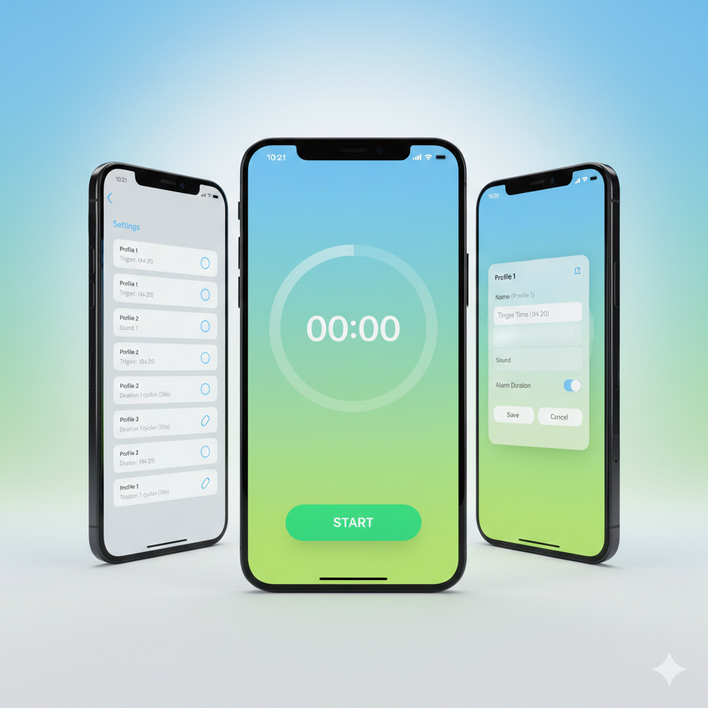

# Routine Stopwatch

A feature-rich Flutter stopwatch application designed for managing timed routines with customizable profiles, alarms, and background execution.

## Features

- **Precision Stopwatch** -- Track elapsed time with a circular progress display in MM:SS format
- **Profile System** -- Create and manage up to 8 stopwatch profiles, each with custom trigger times, alarm sounds, and durations
- **Configurable Alarms** -- Choose from 8 different alarm sounds with adjustable duration (fixed cycles or play until stopped)
- **Background Execution** -- Timer continues running when the app is backgrounded or closed
- **State Persistence** -- Remembers timer state, elapsed time, and profile settings across sessions
- **Local Notifications** -- Get notified when a timer triggers while the app is in the background

## Screenshots

<p align="center">
  
</p>

## Architecture

The project follows **Clean Architecture** with the BLoC pattern for state management:

```
lib/
├── core/                    # Constants, theme, utilities
│   ├── constants/           # App-wide and sound constants
│   ├── theme/               # Material 3 theme configuration
│   └── utils/               # Time formatting helpers
├── data/                    # Data layer
│   ├── datasources/         # SharedPreferences local storage
│   ├── models/              # Data models with serialization
│   └── repositories/        # Repository implementations
├── domain/                  # Business logic layer
│   ├── entities/            # Core domain models
│   ├── repositories/        # Repository contracts
│   └── usecases/            # GetProfiles, SaveProfile, SetActiveProfile
├── presentation/            # UI layer
│   ├── bloc/                # StopwatchBloc, ProfileBloc, AlarmBloc
│   ├── injection/           # GetIt service locator setup
│   ├── screens/             # Home and Settings screens
│   ├── services/            # Timer, Audio, Background services
│   └── widgets/             # StopwatchDisplay, AlarmStopButton, ProfileEditDialog
└── main.dart
```

## Tech Stack

| Category | Package |
|----------|---------|
| State Management | `flutter_bloc` |
| Dependency Injection | `get_it` |
| Local Storage | `shared_preferences` |
| Audio Playback | `audioplayers` |
| Notifications | `flutter_local_notifications` |
| Value Equality | `equatable` |

## Getting Started

### Prerequisites

- Flutter SDK `^3.10.1`
- Dart SDK `^3.10.1`

### Installation

1. Clone the repository:
   ```bash
   git clone https://github.com/your-username/routine-stopwatch.git
   cd routine-stopwatch
   ```

2. Install dependencies:
   ```bash
   flutter pub get
   ```

3. Run the app:
   ```bash
   flutter run
   ```

## Usage

1. **Start a timer** -- Tap the START button on the home screen to begin timing
2. **Pause/Resume** -- Tap PAUSE to temporarily stop, RESUME to continue
3. **Configure profiles** -- Tap the gear icon to open Settings and manage profiles
4. **Edit a profile** -- Tap any profile card to set a custom name, trigger time, alarm sound, and duration
5. **Switch profiles** -- Use the radio button next to a profile to set it as active
6. **Stop alarm** -- When the trigger time is reached, tap STOP ALARM to silence it
